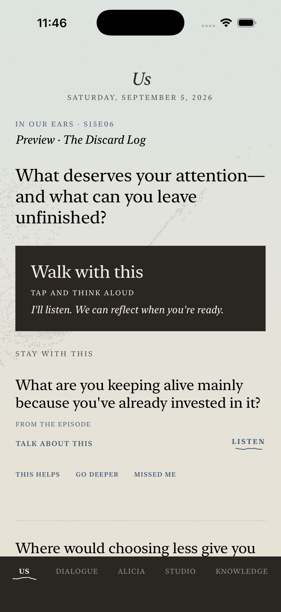
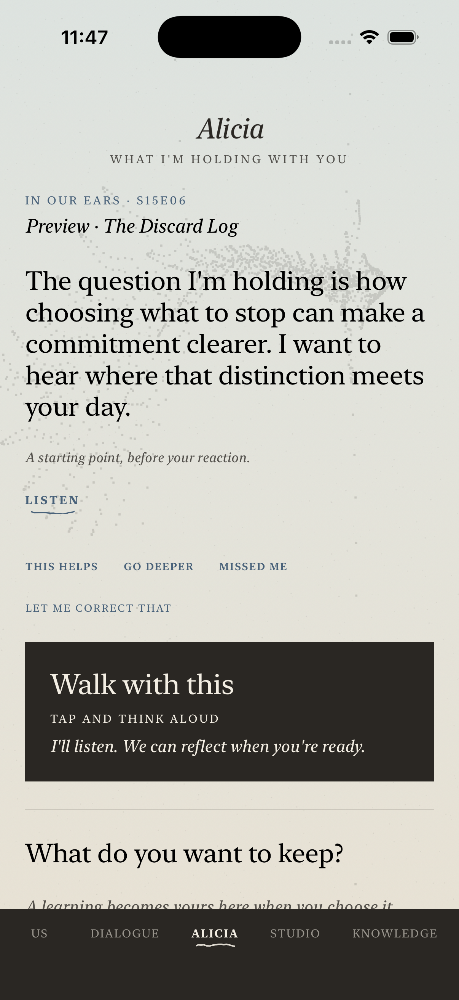
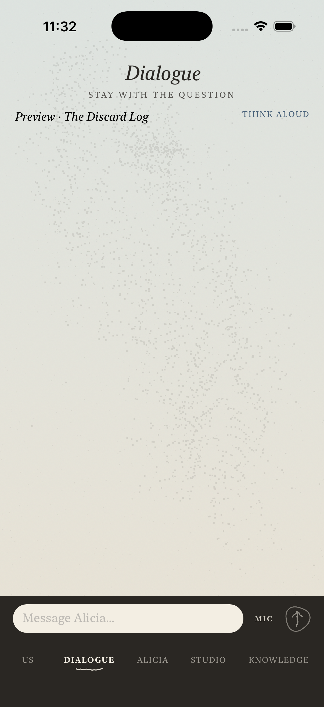
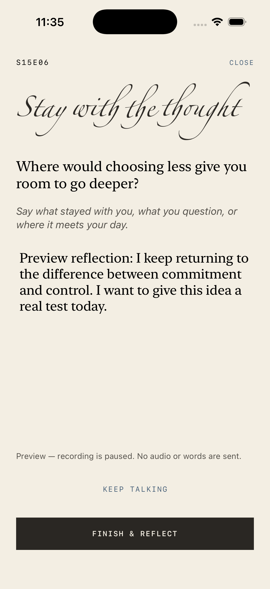
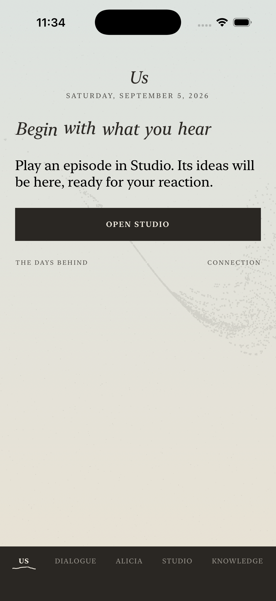
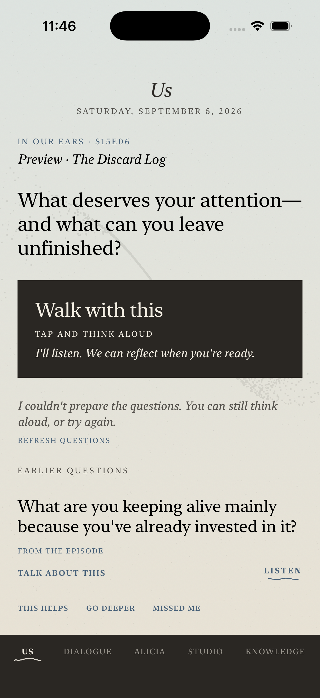

# Episode day — simulator preview

Labelled sample content on iPhone 17 / iOS 26.5. No live frame generation or
vault writes. These are presentation checks; on-device speech remains unverified.

| Us | Alicia |
|---|---|
|  |  |

| Dialogue | Walk reflection |
|---|---|
|  |  |

| No episode yet | Frame unavailable |
|---|---|
|  |  |

[Reduce Motion enabled](us-reduce-motion.png) uses the existing static presence.
The capture also shows the retained-draft return action. The simulator preference
was read back as enabled and restored to its previous disabled value afterward.

Build and save-lifecycle checks passed. See [handoff](../EPISODE_DAY.md).
