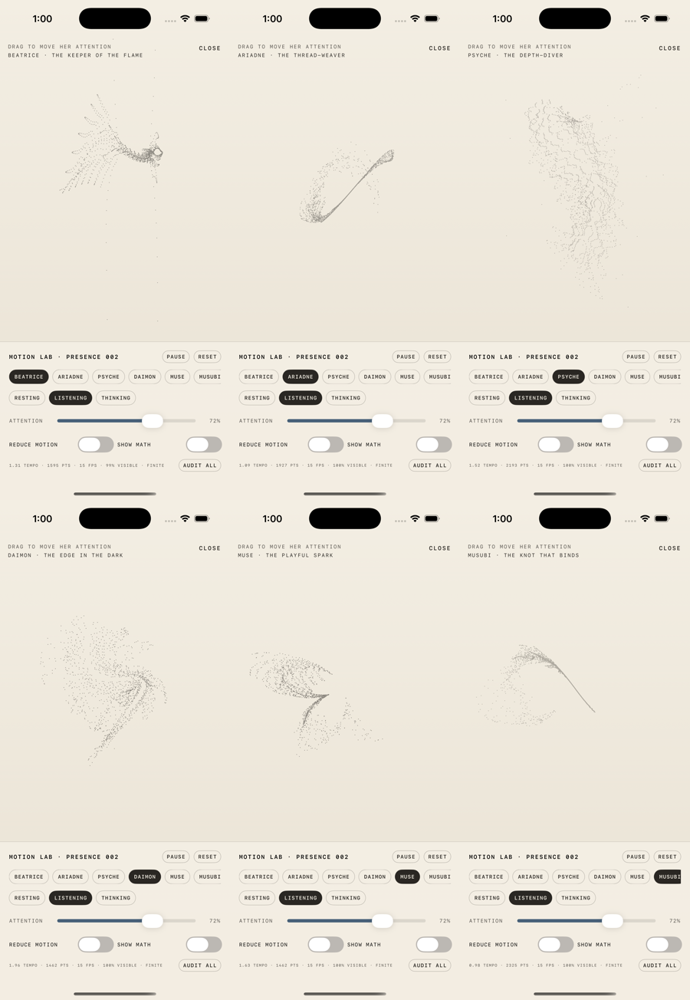
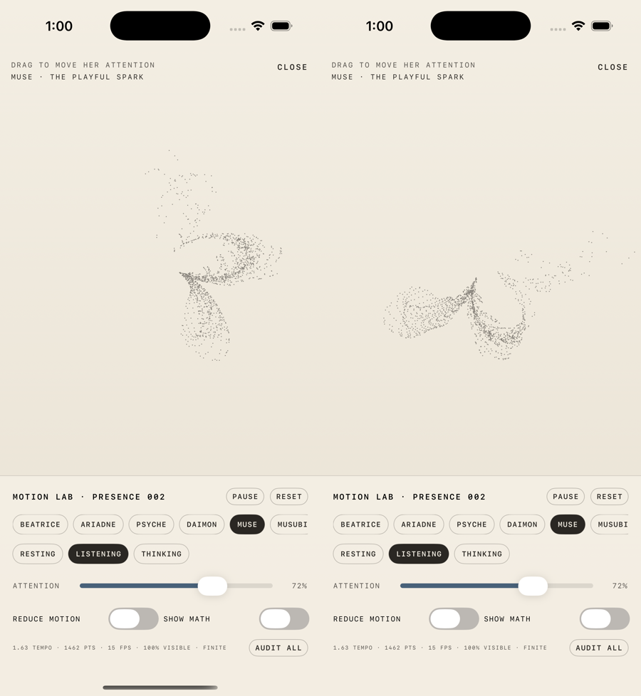
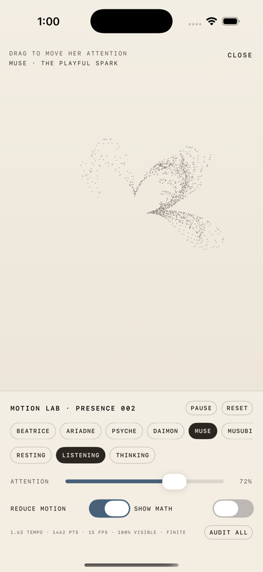
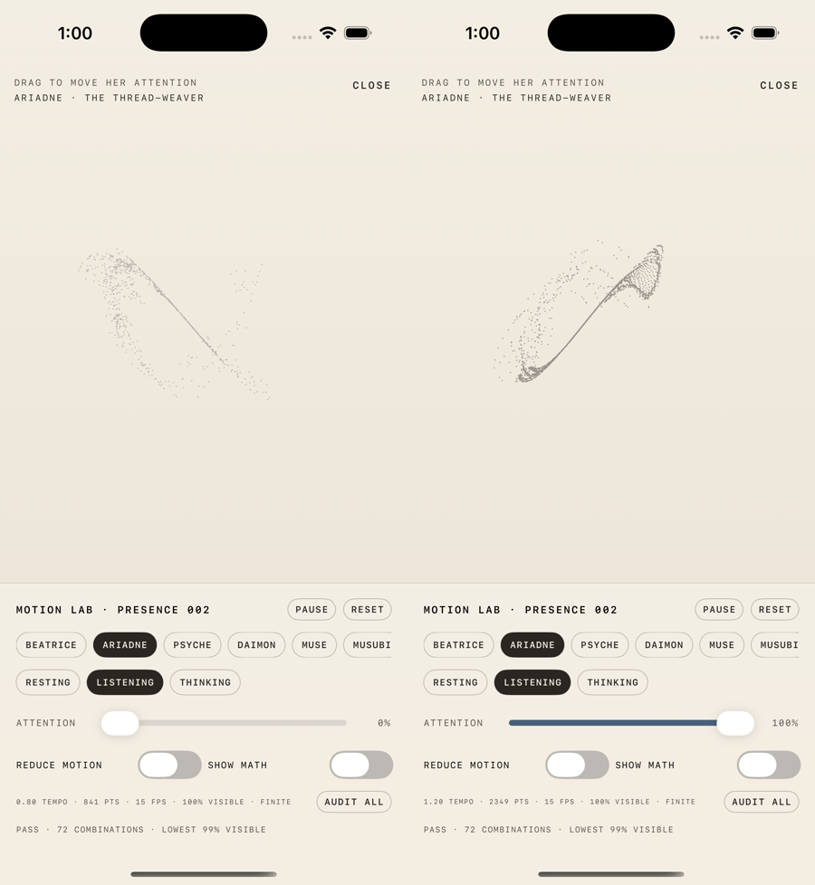

# Archetype Presence Lab evidence

Captured on the iPhone 17 simulator from the DEBUG-only Motion Lab on
2026-08-16. Simulator imagery and resource samples are review evidence, not
final device visual or performance approval.

## Six geometric families

All six captures use LISTENING at 72% ATTENTION. From left to right, top then
bottom: Beatrice drift, Ariadne weave, Psyche depth, Daimon singular, Muse
bloom, and Musubi knot.

## Motion and Reduce Motion

The two frames differ after excluding the simulator status area:

- Frame A pixel MD5: `79ae8f9448df3251da2a6ac329183d01`
- Frame B pixel MD5: `7d68ff71142b1fd221c94982452cd9ba`

Two Reduce Motion captures one second apart produced the same cropped pixel
MD5: `d96c628268dc964943f84c6817933ffe`.

## Bounds and resource evidence

At both 0% and 100% ATTENTION, AUDIT ALL passed 72 combinations: six voices,
three states, and four representative phases. The lowest visible-point
fraction was 99%, and every sampled point was finite.

The maximum-density Psyche field at 100% ATTENTION was sampled five times on
the simulator after launch. The host process used 5.4%, 10.4%, 8.7%, 7.5%,
and 6.9% CPU, with resident memory between 210,880 and 211,360 KB. This is a
relative simulator check only. Pandaiux remains the required performance gate
before promotion.
